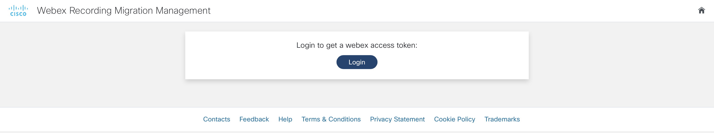
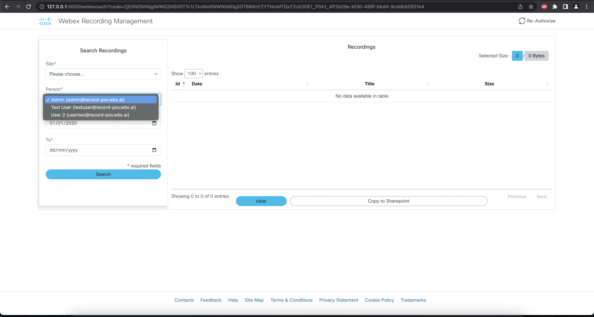
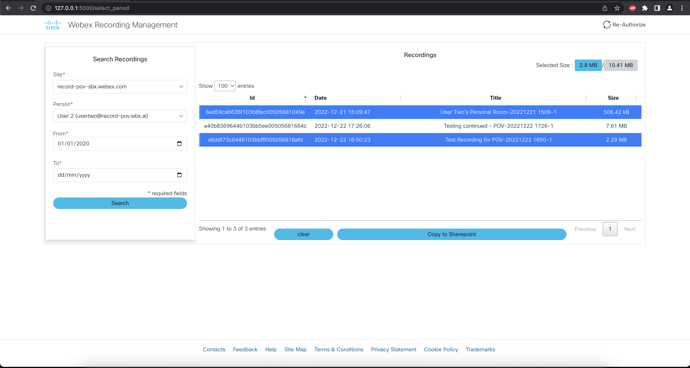
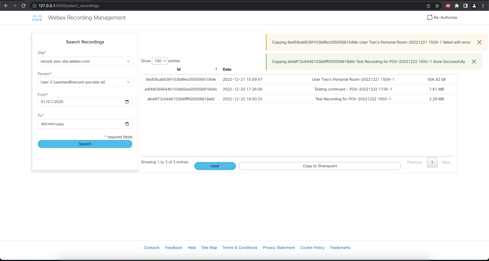
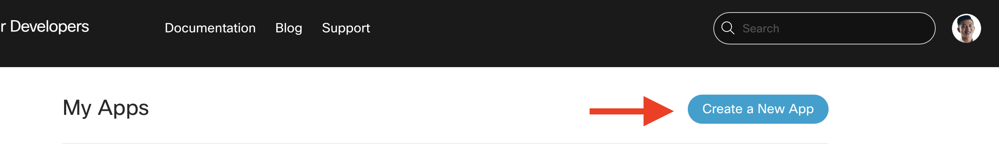
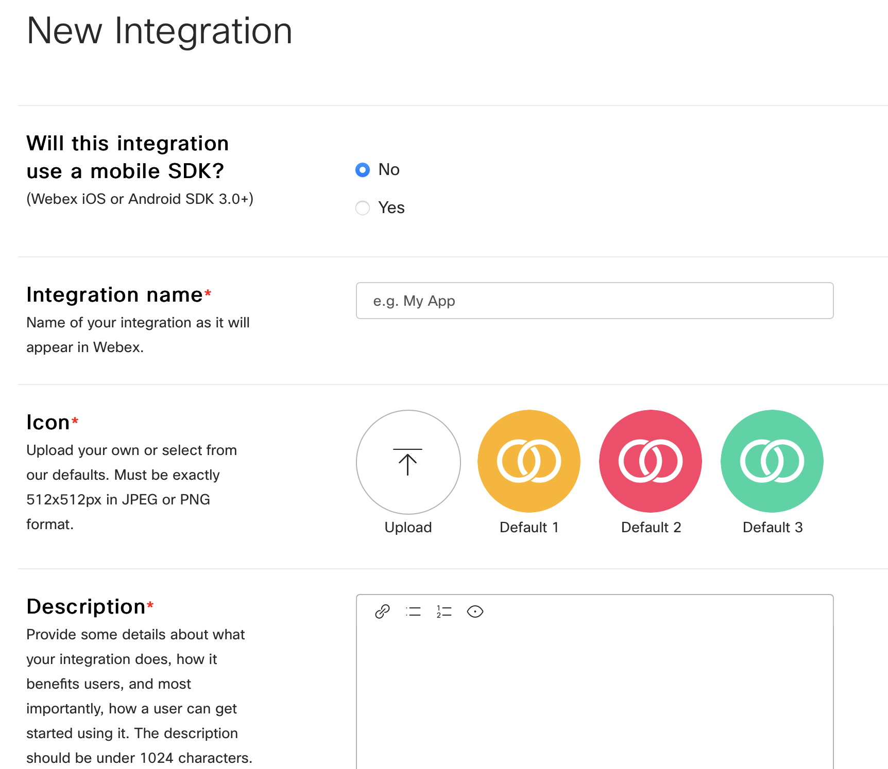
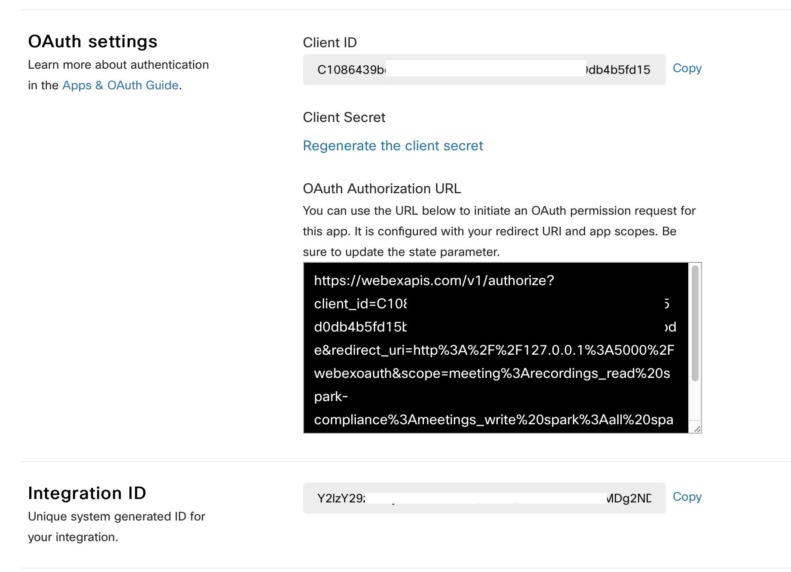
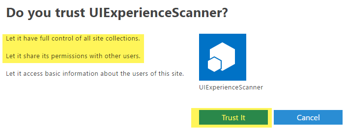

# GVE DevNet Webex Recording to Sharepoint
Please note: We have extended the code for the admin user, so the admin user can copy required/all the recordings to a cloud storage solution (sharepoint). 

Cisco Webex is THE unified app for the future of work, where you can call, meet, collaborate and message. Webex allows you to record meetings if needed and the Webex cloud stores recordings by default up to one year and with a maximum of 10 years. However, some customers are required by law to store recordings for a longer period of time. 

By using the Webex and Sharepoint API, we have created a Flask application that integrates the two solutions and allows the user to copy recordings from the Webex cloud to the Sharepoint cloud. We can copy the recordings in a few simple steps:

0. First, we have to login and obtain our Webex access token:



1. After having logged in and authorized the application, we should select the `siteUrl`, the `period` and the `hostEmail` that we are interested in:



2. Then, we will obtain a table of all the recordings that are available and it will be immediately indicated if the Webex recording has been Copied to the cloud or not: 



3. When you have selected the recordings that you would like to copy, you can press the button `Copy to Sharepoint` to start the copying process and afterwards you will get a summary of the recordings that have copied: **gve_devnet_webex_recordings_to_sharepoint**
For Easier downloading of webex recording to the sharepoint site in bulk

 

### Contacts
* Raveesh V
  
### Contributors
* Simon Fang

## Solution Components
* Webex
* Flask
* Python
* Sharepoint

## Prerequisites
* Webex OAuth Integration
* Sharepoint Integration Details (Client + Tenant Details)
* Webex Account

## How to register your own Webex OAuth integration
Registering an integration with Webex is easy and can be done in a couple of steps. If you have already registered your Webex OAuth integration with the right scopes, then you can skip this step.

1. First, head over to developer.webex.com and log in:


2. After having logged in, click on your avatar and select `My Webex Apps` from the menu under your avatar. 


3. On the new page, click `Create a New App` in the top right corner:



4. Then, click `Create an Integration` to start the wizard: 


5. In the wizard, fill in the form fields:

    * **Name:** The name of the app, e.g. My Webex Integration
    * **Icon:**: Choose an icon or upload an icon
    * **Description:** Explain what your integration can do. Note that these details are not displayed to the end-users of the integration
    * **Redirect URI(s):** Important! The Redirect URI has to match with the `webex_integration_redirect_uri` in the `.env` file. In our case, this will be `"http://127.0.0.1:5000/webexoauth"`
    * **Scopes:** We have to define the level of access that our integration requires. For our app, we require the following scopes: 

        * `meeting:recordings_read`
        * `meeting:admin_recordings_read`
        * `spark-admin:organizations_read`
        * `spark-admin:people_read`
        * `meeting:preferences_read` 

        *Ignore following if not avaialable*
        * `spark:kms` 
   




6. After having filled in the details, click on `Add integration` and you will be taken to the next page, where you will be given the `Client ID` and `Client Secret` along with the OAuth Authorization URL. It is important to copy and store the `Client Secret` in a safe place as it will be generated and displayed only once for security purposes. In case you lose it, then a new client secret will be regenerated: 



> Note: the documentation for Webex integrations can be found [here](https://developer.webex.com/docs/integrations)

## Generating Client information in sharepoint

Step 1: Registering New App to get Client information for tenant  
>https://**(your sharepoint site)**/_layouts/15/appregnew.aspx


Step 2: Enabling Access to the registered app
Next step is granting permissions to the newly created principal. Since we're granting tenant scoped permissions this granting can only be done via the appinv.aspx page on the tenant administration site. You can reach this site via 
> https://**(your sharepoint site)**/_layouts/15/appinv.aspx. 


```xml
<AppPermissionRequests AllowAppOnlyPolicy="true">
  <AppPermissionRequest Scope="http://sharepoint/content/tenant" Right="FullControl" />
</AppPermissionRequests>
```



> Note: the documentation for Sharepoint integrations can be found [here](https://learn.microsoft.com/en-us/sharepoint/dev/solution-guidance/security-apponly-azureacs)


## Installation/Configuration

The following commands are executed in the terminal.

1. Create and activate a virtual environment for the project:
   
        #WINDOWS:
        $ py -3 -m venv [add_name_of_virtual_environment_here] 
        $ [add_name_of_virtual_environment_here]/Scripts/activate.bat
        #MAC:
        $ python3 -m venv [add_name_of_virtual_environment_here] 
        $ source [add_name_of_virtual_environment_here]/bin/activate
        
> For more information about virtual environments, please click [here](https://docs.python.org/3/tutorial/venv.html)

2. Access the created virtual environment folder

        $ cd [add_name_of_virtual_environment_here]

3. Clone this repository

        $ git clone [add_link_to_repository_here]

4. Access the folder 

        $ cd [folder_name]

5. Install the dependencies:

        $ pip install -r requirements.txt

6. Open the `.env` file and add the environment variables. In the sections above, it is explained how to obtain these credentials and variables. Please note that all the variables below are strings.

    ```python
    # Webex integration credentials
    webex_integration_client_id = "<insert_webex_integration_client_id>"
    webex_integration_client_secret= "<insertwebex_integration_client_secret>"
    webex_integration_redirect_uri = "http://127.0.0.1:5000/webexoauth"
    webex_integration_scope = "meeting:recordings_read spark:kms meeting:admin_recordings_write spark-admin:organizations_write spark-admin:people_write meeting:recordings_write meeting:admin_recordings_read spark-admin:organizations_read spark-admin:people_read meeting:preferences_read"
   
   # Sharepoint Configurations
   CLIENT_ID = '<insert_client_id_here>'
   CLIENT_SECRET = '<insert_client_secret_here>'
   TENANT_ID = "<copy_tenant_id_here>"
   TENANT_URL = "<tenant_url_goes_here>" # eg: contoso.sharepoint.com
   SITE_NAME = "<your_site_name_goes_here>"
   
   # Sharepoint Shared Documents target Folder
   RECORDINGS_FOLDER='Recordings' 

    ```

## Usage
Now it is time to launch the application! Simply type in the following command in your terminal:

    $ python app.py

Then, head over to the URL that is displayed in the terminal output. 


### LICENSE

Provided under Cisco Sample Code License, for details see [LICENSE](LICENSE.md)

### CODE_OF_CONDUCT

Our code of conduct is available [here](CODE_OF_CONDUCT.md)

### CONTRIBUTING

See our contributing guidelines [here](CONTRIBUTING.md)

#### DISCLAIMER:
<b>Please note:</b> This script is meant for demo purposes only. All tools/ scripts in this repo are released for use "AS IS" without any warranties of any kind, including, but not limited to their installation, use, or performance. Any use of these scripts and tools is at your own risk. There is no guarantee that they have been through thorough testing in a comparable environment and we are not responsible for any damage or data loss incurred with their use.
You are responsible for reviewing and testing any scripts you run thoroughly before use in any non-testing environment.
